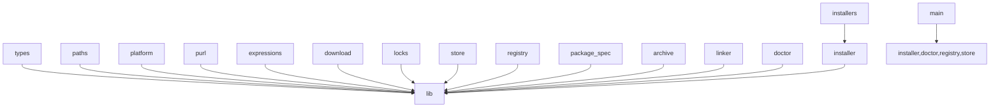

# Implementation Plan & History

## Architecture & Commit Plan

```
80f0434 ── feat(core): add registry and package primitives
    ├── .gitignore
    ├── Cargo.toml / Cargo.lock (workspace root)
    ├── crates/mason4agents/Cargo.toml (crate manifest, lib only)
    ├── src/lib.rs              # crate root, module tree
    ├── src/types.rs            # M4aError, Result, JSON envelope
    ├── src/paths.rs            # XDG directory resolution
    ├── src/platform.rs         # Platform detection + target selection
    ├── src/purl.rs             # PURL parser
    ├── src/expressions.rs      # Template rendering
    ├── src/package_spec.rs     # Mason YAML parsing, normalization
    ├── src/download.rs         # HTTP download + cache
    ├── src/registry.rs         # Registry fetch/refresh/search
    ├── src/store.rs            # Installed state persistence
    └── src/locks.rs            # File-based package locks

46b5cb5 ── feat(installer): add package installation runtime
    ├── src/lib.rs              # +archive, +doctor, +installer, +installers, +linker
    ├── src/archive.rs          # Safe zip/tar/gz extraction
    ├── src/doctor.rs           # Diagnostic reports
    ├── src/installer.rs        # Install/uninstall/update orchestration
    ├── src/installers/         # Package-manager & build-script runners
    │   ├── mod.rs
    │   ├── manager.rs          # npm/pypi/cargo/golang/gem/composer/luarocks/nuget
    │   ├── build.rs            # Build script execution
    │   ├── github.rs           # GitHub release assets
    │   ├── generic.rs          # Generic download
    │   ├── openvsx.rs          # OpenVSX vsix
    │   ├── npm.rs, pypi.rs, cargo.rs, golang.rs  # Manager stubs
    └── src/linker.rs           # Symlink/wrapper management

6688fb1 ── feat(cli): add text-first mason4agents interface
    ├── crates/mason4agents/Cargo.toml  # +[[bin]]
    ├── src/main.rs                     # CLI entrypoint, 10 subcommands, text-first output
    ├── tests/cli_fixture.rs            # Integration tests (CLI flow, JSON envelope)
    ├── tests/real_registry_smoke.rs    # Network smoke test (ignored)
    └── test/fixtures/registry/         # Test fixture package.yaml

9de19bf ── feat(pi): add Mason tools adapter
    ├── package.json, bun.lock, tsconfig.json
    ├── src/bin/mason4agents.ts          # npm bin shim
    ├── src/pi/binary.ts                 # Binary resolver (env → bundled → debug)
    ├── src/pi/cli.ts                    # Rust binary invocation bridge
    ├── src/pi/extension.ts              # Pi extension activation
    ├── src/pi/mason-panel.ts            # /mason panel
    ├── src/pi/path-env.ts               # PATH injection
    ├── src/pi/pi-tools.ts               # 7 registered tools
    └── test/pi/                         # 13 TypeScript tests

471693a ── docs: document mason4agents usage
    ├── AGENTS.md     # Developer guide, conventions, testing
    ├── README.md     # English user documentation
    └── README.zh.md  # Chinese user documentation
```

## Design Decisions

### Rust core + TypeScript glue
All install logic in Rust; TypeScript only for Pi extension registration and binary resolution.

### JSON protocol
CLI always outputs `{"ok":true,"data":...}` or `{"ok":false,"error":{...}}` when `--json` is passed.
Stderr for progress/logs. Default output is human-readable text.

### Global state lock + per-package lock
Global `_state` lock acquired first, package lock second to prevent concurrent state corruption.

### Asset selection via YAML order
Uses sequence iteration order (not BTreeMap) to preserve Mason registry ordering.

### Binary naming
`native/mason4agents-{process.platform}-{process.arch}` (Node native names: `win32`, `darwin`, `linux`) with `.exe` on Windows.

### deprecation field
Custom serde deserializer accepts bool, object, or absent as boolean.

### Text-first output
All commands output human-readable text by default. `--json` flag switches to machine-readable JSON.
Error output: JSON envelope when `--json`, else `Error: <message>` on stderr.

### No shell profile modification
`mason4agents env` outputs shell snippets for manual sourcing. Non-goal: v1.

## Module Dependencies



## Commit Rules

- Each commit MUST compile (lib or bin targets separately)
- `cargo fmt --check && cargo clippy --all-targets -- -D warnings && cargo test` MUST pass at each CLI/installer commit
- `tsc --noEmit && bun test` MUST pass at Pi adapter commit
- Follow conventional commits: `feat:`, `fix:`, `docs:`, `refactor:`, `test:`, `chore:`

## Future (v2)

- Claude Code / Codex / Copilot / OpenCode adapters
- MCP server
- Shell profile modification
- npm publish